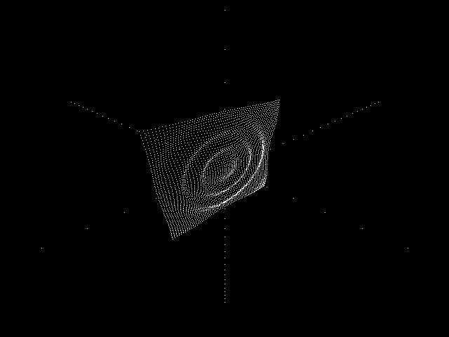



## World 3D with Pure VB Code

### Description

This a 3D program with PURE vb code

NO References, No OCX, NO DLL.

For any question please contact me at:

kmatrixl@hotmail.com
 
### More Info
 

             |
---                |---
**Submitted On**   |2004-06-30 23:45:12
**By**             |[kaci lounes](https://github.com/Planet-Source-Code/PSCIndex/blob/master/ByAuthor/kaci-lounes.md)
**Level**          |Intermediate
**User Rating**    |5.0 (10 globes from 2 users)
**Compatibility**  |VB 3\.0, VB 4\.0 \(16\-bit\), VB 4\.0 \(32\-bit\), VB 5\.0, VB 6\.0
**Category**       |[Graphics](https://github.com/Planet-Source-Code/PSCIndex/blob/master/ByCategory/graphics__1-46.md)
**World**          |[Visual Basic](https://github.com/Planet-Source-Code/PSCIndex/blob/master/ByWorld/visual-basic.md)
**Archive File**   |[World\_3D\_w176665762004\.zip](https://github.com/Planet-Source-Code/kaci-lounes-world-3d-with-pure-vb-code__1-54791/archive/master.zip)

